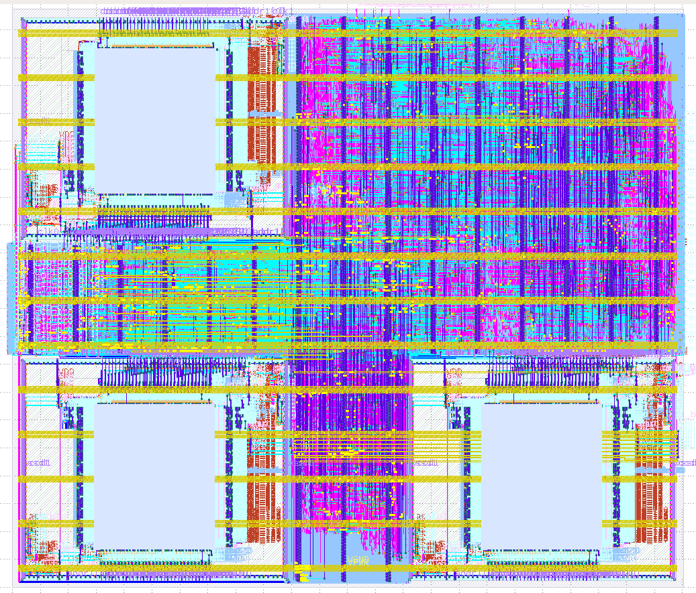

# Systolic_1M: High-Performance Tensor Core on Sky130 🚀


## 📌 Overview
**Systolic_1M** is a hardened Systolic Array core designed for Matrix Multiplication acceleration (Tensor Processing). Implemented using the **OpenLane** open-source flow and **SkyWater 130nm** PDK, this design integrates **120k logic gates** and **3 Hard Macros (SRAMs)** into a compact 1.49mm² core.

This project focuses on resolving complex Physical Design bottlenecks including routing congestion in narrow channels, macro power delivery, and signoff LVS violations.

---

## 📸 Final Layout (GDSII)

*Fig 1: Final GDSII showing 3x SRAM Macros (Red) and Standard Cell Logic (Blue/Purple).*

---

## ⚡ Key Specifications
| Metric | Value | Notes |
| :--- | :--- | :--- |
| **Technology** | SkyWater 130nm | Open Source PDK |
| **Clock Frequency** | **125 MHz** | Met Setup/Hold across all corners |
| **Die Area** | 1.49 mm² | Optimized for 83% Utilization |
| **Gate Count** | ~120,000 | + 3x 32x256 SRAM Macros |
| **Power Strategy** | 1.8V | Custom PDN with 5% IR Drop Limit |
| **Status** | **DRC/LVS Clean** | 0 Violations |

---

## 🛠️ The Engineering Journey ("War Stories")
Physical Design is about solving problems. Here is how I debugged the critical issues in this core:

### 1. The "Bowling Alley" Congestion Fix
**The Problem:** Initial macro placement created narrow channels between SRAMs. The router failed with **250% overflow** trying to force 32k cells through these gaps.
**The Solution:**
* Redesigned floorplan to a U-Shape configuration.
* Applied custom `PL_MACRO_HALO` constraints to reserve routing resources.
* Used `RT_MIN_LAYER` to force global signals to Metal 3-5.

*Fig 2: Routing Congestion Map showing clean routing (Blue) after optimization.*

### 2. Solving 5,430 LVS Violations
**The Problem:** Signoff failed with thousands of mismatches.
**Root Causes & Fixes:**
* **Row Orientation:** "Flipped South" (FS) cells were placed in "North" (N) rows, causing VDD/VSS shorts. Fixed via legalizer constraints.
* **Floating Inputs:** Unused ports on Dual-Port SRAMs were floating, causing leakage. I modified the Verilog/Tcl to tie unused Clock to Ground and Address lines to `8'h00`.

### 3. Custom Power Distribution (PDN)
**The Problem:** The tool was "trimming" (deleting) Metal 5 power stripes because they weren't connecting to standard cells.
**The Solution:** Wrote a custom `pdn_cfg.tcl` script to explicitly define the Vias and connections from M1 → M4 → M5, ensuring a robust mesh.

---

## 📂 Repository Structure
* `src/`: Verilog source code.
* `openlane/`: Configuration files (`config.tcl`, `macro.cfg`).
* `scripts/`: Custom Tcl scripts for congestion analysis and LVS fixes.
* `docs/`: Detailed PPA reports and logs.

## 🚀 How to Run
To reproduce this layout using OpenLane:

```bash
# Clone the repo
git clone [https://github.com/YOUR_USERNAME/systolic_1M.git](https://github.com/YOUR_USERNAME/systolic_1M.git)

# Enter OpenLane container
make mount

# Run the flow
./flow.tcl -design systolic_1M -tag final_run
