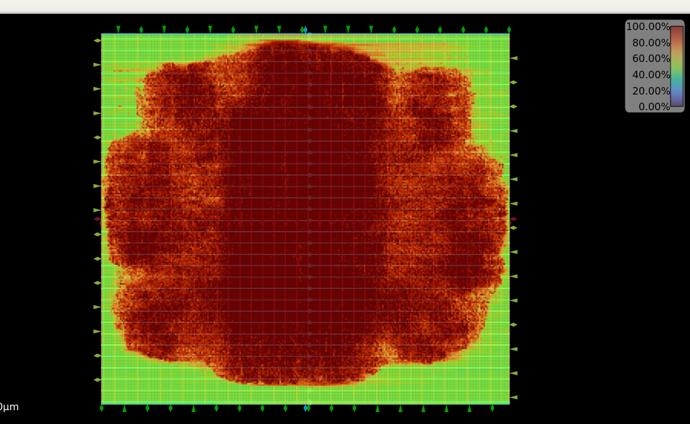
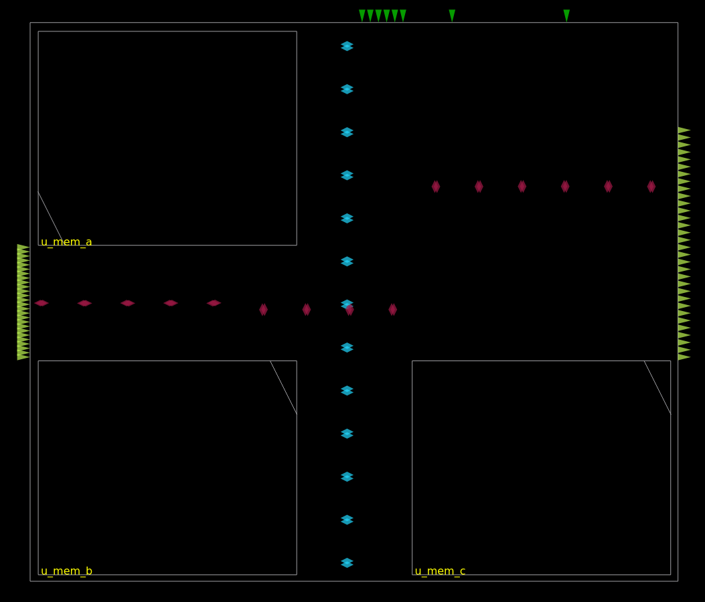
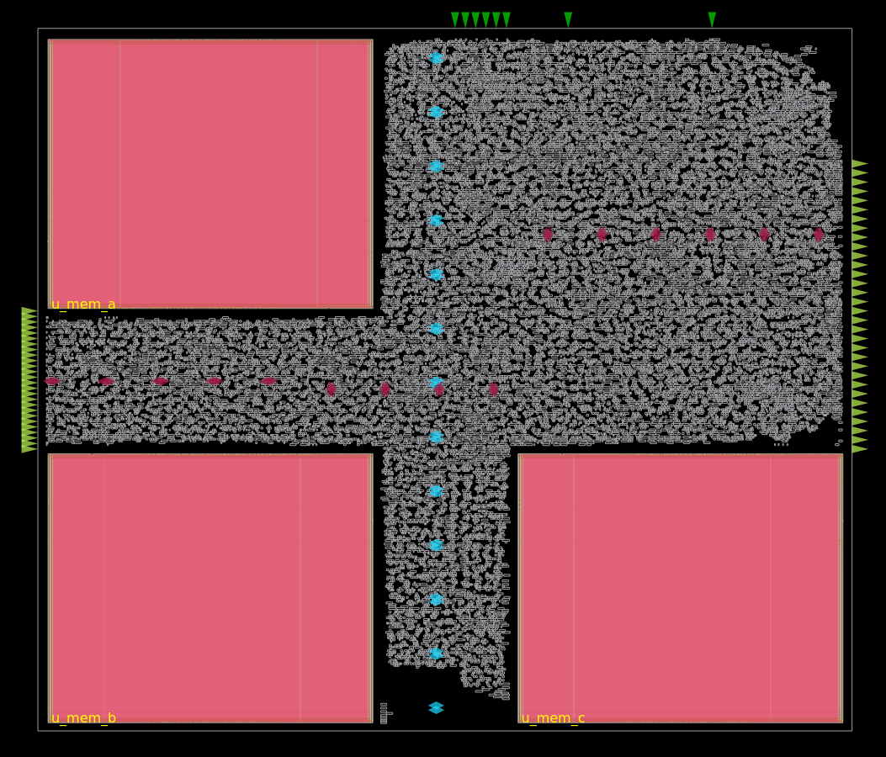
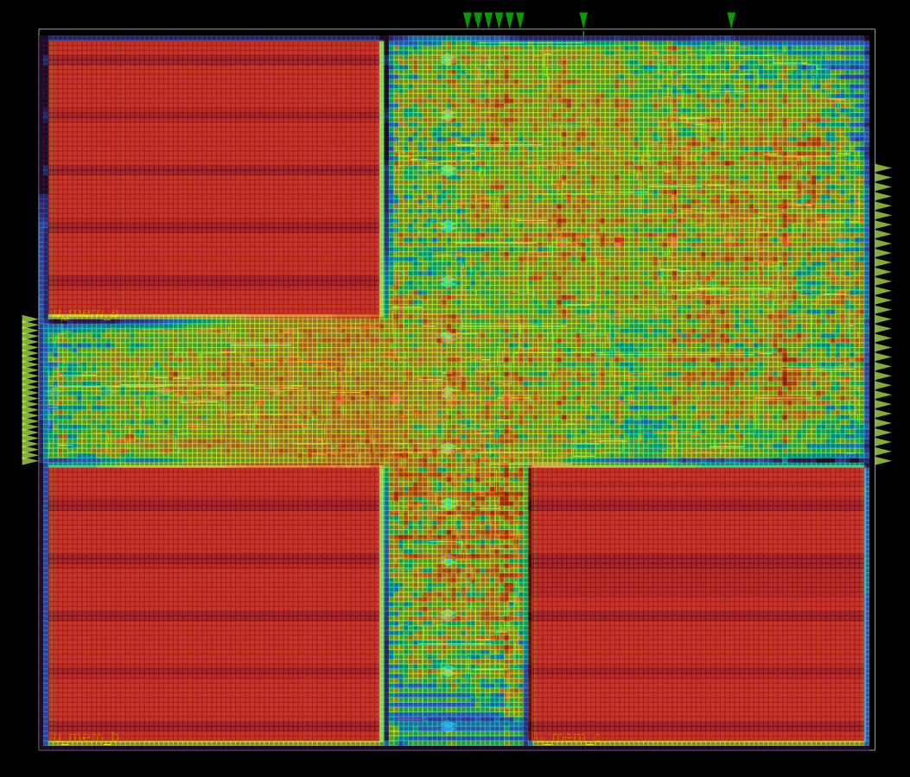
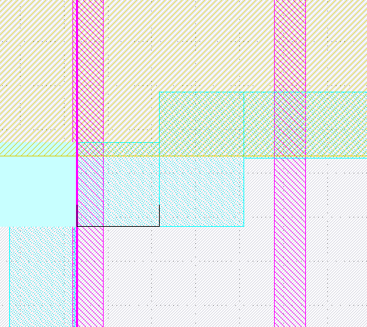
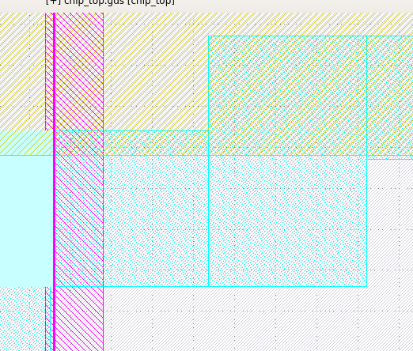
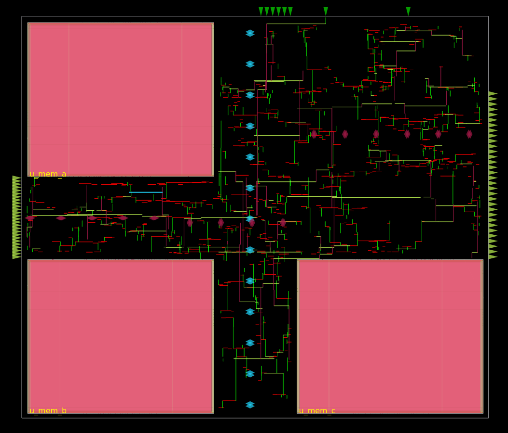

# 🧠 Systolic_array  
### High-Performance Systolic Array Accelerator on Sky130 🚀

---

## 📌 Overview

**Systolic_array** is a hardened systolic array accelerator designed for matrix multiplication workloads.  
The design is implemented using the **OpenLane RTL-to-GDS flow** on **SkyWater 130nm**.

This project was intentionally started **without SRAM macros** to expose real-world Physical Design bottlenecks such as congestion, fanout explosion, PDN failures, LVS mismatches, and timing instability.  
After reaching physical limits, the RTL and floorplan were redesigned around **three SRAM macros**, resulting in a compact, routable, and timing-closed design.

---

## ⚡ Key Specifications

| Metric | Value |
|------|------|
| Technology | SkyWater 130nm |
| Flow | OpenLane / OpenROAD |
| Core Area | **1.49 mm²** |
| Gate Count | **~120k** |
| SRAM Macros | **3 × 32×256** |
| Clock Frequency | **125 MHz** |
| Supply Voltage | 1.8 V |
| Utilization | ~83% |
| IR Drop Target | 5% |
| DRC | Clean |
| LVS | Clean |

---

## 🧭 Project Evolution

### Phase 1: Macro-less Architecture (Intentional Stress Test)

The project began without SRAM macros, storing all state using flip-flops.

#### Issues Observed
- 6–7× flip-flop overhead
- Area expanded to ~11 mm²
- Extreme routing congestion
- Fanout and slew violations
- Impossible timing closure

#### Routing Failure & Congestion (No Macros)

**Fig 1:** Congestion heat map showing >250% overflow caused by forcing tens of thousands of standard cells through narrow routing channels.

This phase confirmed that **architecture decisions directly define physical feasibility**.

---

## Phase 2: Macro-Based Redesign

To resolve scalability issues, the RTL was redesigned using **three SRAM macros** for storage.

### Benefits
- Massive reduction in flip-flop count
- Area reduced by ~7×
- Improved routability
- Feasible PDN and timing closure

However, macro integration introduced new Physical Design challenges.

---

## 🧱 Floorplanning Strategy (U-Shape)

Initial macro placement created narrow “bowling-alley” channels that trapped routing.

### Final Floorplan

**Fig 2:** U-shape macro placement along the edges, creating a wide central routing region.

### Key Techniques
- U-shape macro placement
- Custom `PL_MACRO_HALO` constraints
- Aspect-ratio optimization
- Macro alignment to routing grid

---

## 🧩 Standard Cell Placement

**Fig 3:** Standard cell placement after congestion optimization, showing balanced density and whitespace for buffering and ECOs.

---

## 🚦 Congestion Analysis & Resolution

**Fig 4:** Post-optimization congestion map with overflow reduced below 100%.

### Root Cause
- Global utilization was low (~46%)
- Local congestion caused by macro spacing and IO density
- Router could not insert buffers to fix slew and fanout

### Fixes Applied
- Reduced `FP_CORE_UTIL`
- Enabled aggressive buffering
- Forced routing to upper metal layers (`RT_MIN_LAYER`)
- Spread IO pins using `FP_IO_MODE 1`

---

## ⚡ Power Distribution Network (PDN)

### Issues Encountered
- Missing horizontal Metal-5 straps
- PDN stripes trimmed due to floating connections
- Macro power pins not aligning with grid

### Solution
A custom `pdn_cfg.tcl` was written to explicitly define the full power stack:

This ensured robust connectivity and eliminated PDN trimming.

---

## 🔍 LVS Debugging (5,430 → 0)

### Major Root Causes
1. Floating inputs on unused SRAM ports  
2. Unused dual-port clocks left floating  
3. Row orientation mismatch (MX cells in N rows)  
4. Macro pin hook-up blockages  

### Fixes
- Tied unused clocks to **VSS**
- Disabled unused macro ports via enable pins
- Used **Tie-Hi / Tie-Lo** cells
- Legalized cell orientations
- Increased macro keep-out margins

---

## 🧪 DRC Status

### Before Fix

**Fig 5:** DRC violations due to PDN overlap and insufficient macro spacing.

### After Fix

**Fig 6:** Clean DRC after halo tuning, PDN offset correction, and cell padding.

---

## ⏱️ Timing Closure

### Initial State
- 10 ns clock (100 MHz)
- Unconstrained SRAM outputs
- Max slew and fanout violations

### Key Fixes
- Manual constraints for SRAM outputs
- Aggressive buffering
- Target density tuned to ~0.60
- Hold repair enabled
- Antenna violations fixed using jumper insertion

### Final Result
- Clock period: **8 ns**
- Frequency: **125 MHz**
- Setup slack: ~+70 ps
- Hold: Clean

**Fig 7:** Clock Tree Synthesis with balanced insertion delay and clean skew.

---

## 🔥 Power Integrity & Reliability

### Dynamic IR Drop
- Worst-case voltage: **1.57 V**
- Voltage drop: ~228 mV (~12%)
- Verdict: Functionally safe

### Electromigration
- Peak current: ~34 mA
- Result: **0 EM violations**

---

## 🛠️ Automation & Tooling

- Custom Tcl scripts for:
  - Worst timing path extraction
  - Slew and fanout analysis
  - PDN generation
- OpenROAD GUI used for:
  - LVS debugging
  - Orientation verification
  - Macro alignment

---

## 📂 Repository Structure

---

## 🚀 Final Status

- ✅ 125 MHz timing closed  
- ✅ DRC clean  
- ✅ LVS clean  
- ✅ IR & EM verified  
- ✅ Compact **1.49 mm²** core  

This project demonstrates **end-to-end Physical Design ownership**, from architectural trade-offs to signoff-level debugging.

---

## 👤 Author

**Ajay H R**  
Physical Design Engineer | OpenLane | Sky130
